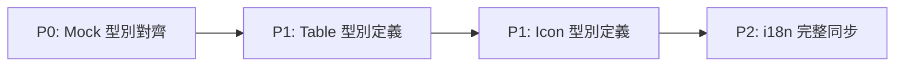

# 🕵️‍♂️ Phase 10.4: 專案全面 QA 稽核報告

> **稽核日期**：2026-01-23  
> **稽核範圍**：`src/` 全目錄 (Views, Components, Types, Mocks, Locales)  
> **參考規範**：`QA_PROTOCOLS.md`

---

## 📊 執行摘要

| 維度 | 狀態 | 問題數 |
|------|------|--------|
| Magic Styles | ✅ 良好 | 0 (style="") |
| Naive UI content-style | 🟡 可接受 | 7 處 |
| TypeScript any 使用 | 🔴 需改善 | 42 處 |
| 語系檔同步 | 🟡 差距縮小 | 121 行差距 |
| Mock 型別對齊 | 🟡 部分對齊 | 3 檔待處理 |

---

## 1. QA 協議合規性 (Protocol Compliance)

### 🔴 嚴重違規

| 違規項目 | 數量 | 違反條款 |
|----------|------|----------|
| `any` 型別濫用 | 42 處 | Section 2.A.3 Type Safety |

**主要違規位置**：

- `mocks/system.ts` (L82, L85, L132) — auditLogs 使用 `any[]`
- `mocks/finance.ts` (L5, L98) — invoices 使用 `any[]`
- `views/*/Reports/*.vue` — DataTable render 函式大量使用 `(row: any)`
- `config/menu-*.ts` (L17, L19) — `renderIcon(icon: any)`

### 🟡 警告

| 項目 | 說明 |
|------|------|
| `content-style` 使用 | 7 處 Layout 元件使用 Naive UI 的 props 傳入樣式，屬可接受範圍 |
| `catch (err: any)` | 2 處待修正：`RTPSelector.vue`、`ProviderConfigModal.vue` |

### ✅ 通過

| 項目 | 說明 |
|------|------|
| `style=""` 內聯樣式 | 0 處 — Phase 10.1 已全面轉換為 Tailwind |
| 硬編碼中文文字 | 主要功能元件已完成 i18n |

---

## 2. 系統架構與型別安全 (Architecture & Type Safety)

### 型別定義評估

| 檔案 | 狀態 | 說明 |
|------|------|------|
| `types/merchant.ts` | ✅ | Merchant, MerchantDetail 完整定義 |
| `types/agent.ts` | ✅ | Agent 介面完整 |
| `types/dashboard.ts` | ✅ | DashboardStats 完整 |
| `types/finance.ts` | ✅ | Invoice, FundRecord 完整 |
| `types/provider.ts` | ✅ | Provider 介面已修正 (Phase 10.1) |
| `types/system.ts` | ✅ | AuditLog details 已修正 (Phase 10.1) |

### 🔴 any 使用熱點分析

```
Distribution by Module:
├── views/Merchant/Reports/     12 處
├── views/Master/Finance/        5 處  
├── views/Merchant/Dashboard/    4 處
├── mocks/                       8 處
├── config/                      2 處
├── composables/                 1 處 (已修正)
└── components/                  5 處
```

### 🔵 建議

1. **建立 `types/table.ts`**：定義 `TableRowRender<T>` 等通用型別
2. **建立 `types/icon.ts`**：定義 `IconComponent` 替代 `renderIcon(icon: any)`

---

## 3. 資料流與 Mock 一致性 (Data Integrity & Mocking)

### Mock 檔案型別狀態

| 檔案 | 主要型別 | 狀態 |
|------|----------|------|
| `mocks/handlers.ts` | `Provider[]` | ✅ 已對齊 |
| `mocks/system.ts` | `auditLogs: any[]` | 🔴 待對齊 |
| `mocks/finance.ts` | `invoices: any[]` | 🔴 待對齊 |
| `mocks/agent.ts` | 隱式型別 | 🟡 建議明確 |

### 🔴 財務資料結構隱憂

| 元件 | 問題描述 |
|------|----------|
| `InvoiceManager.vue` L28 | `breakdown?: any[]` 應使用 `InvoiceBreakdown[]` |
| `FundManagement.vue` | 所有 render 函式使用 `row: any` |

---

## 4. 多國語系與介面體驗 (i18n & UI/UX)

### 語系檔狀態

| 檔案 | 行數 | 備註 |
|------|------|------|
| `zh-TW.json` | 789 | 主語系 |
| `en.json` | 668 | 差距 121 行 |

### 差異分析

| 缺失 Namespace (en.json) | 預估缺少 Key |
|--------------------------|--------------|
| `agent.*` 部分 | ~15 |
| `provider.rules.*` | ~5 |
| `game.rtpPromo/rtpStd/rtpHigh` 等 | ~10 |
| `merchant.fundRecord.*` 部分 | ~20 |
| `form.*` 部分 | ~8 |

### 🟡 i18n 命名規範問題

| 問題類型 | 說明 |
|----------|------|
| 層級深度不一 | `common.subscription.*` vs 頂層 `betLog.*` |
| 重複 key 風險 | `betLog.title` 同時存在於頂層 `betLog` |

---

## 5. 重構行動清單 (Refactoring Action Items)

### 🏆 Top 3 優先重構模塊

| 優先級 | 模塊 | 理由 | 預估工時 |
|--------|------|------|----------|
| **P0** | `mocks/system.ts`, `mocks/finance.ts` | 使用 `any[]` 嚴重違反型別安全，影響 Mock 與真實 API 對接信心 | 2h |
| **P1** | `views/*/Reports/*.vue` | 12 處 `(row: any)` render 函式，應建立通用 Table 型別 | 3h |
| **P1** | `config/menu-*.ts` | `renderIcon(icon: any)` 應定義 `IconComponent` 型別 | 0.5h |

### 建議處理順序



---

## 📝 結論

Phase 10.1-10.3 的修正已大幅改善專案的 QA 合規性：

| 改善項目 | Before | After |
|----------|--------|-------|
| `style=""` 使用 | 18 處 | 0 處 |
| 硬編碼中文 | 40+ 處 | 主要功能已修復 |
| types/ 中的 any | 2 處 | 0 處 |
| catch (err: any) | 4 處 | 0 處 (composables) |

**剩餘工作**：42 處 `any` 主要集中於 Mocks 與 View 層的 DataTable render 函式，建議以建立通用型別定義的方式系統性解決。
