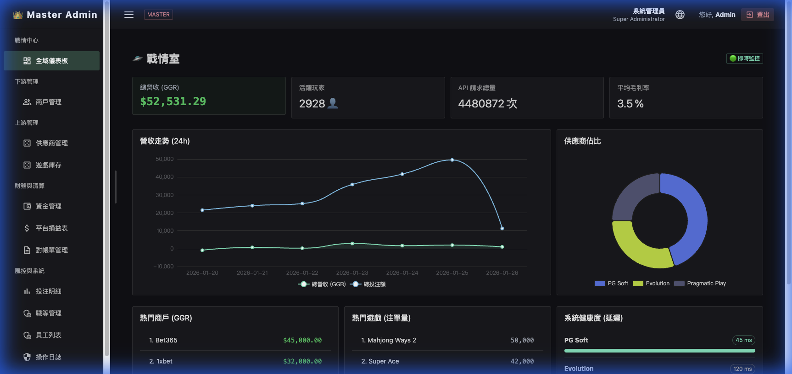
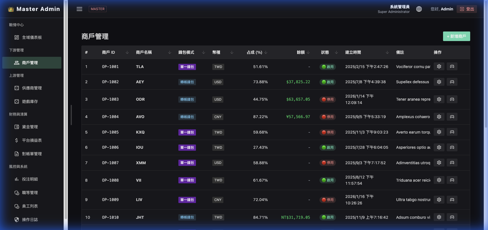
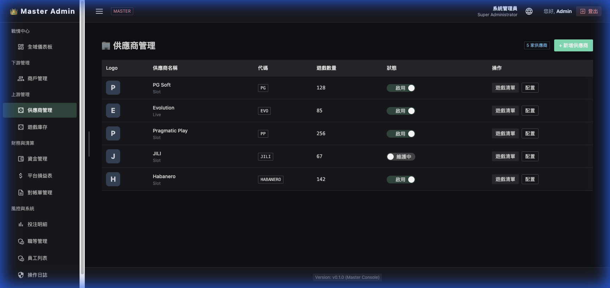
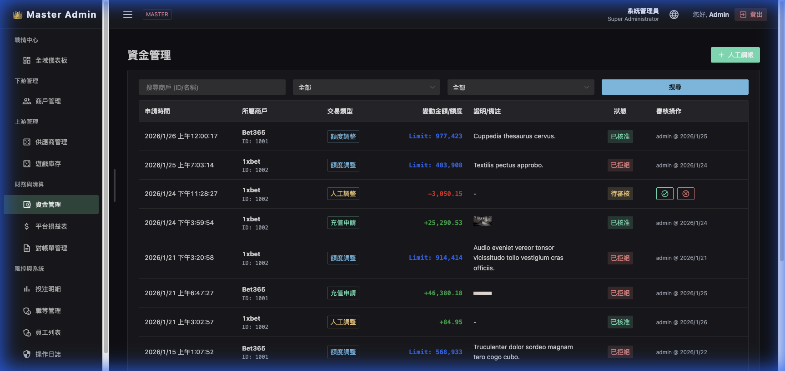
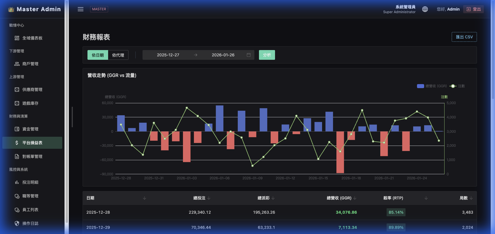
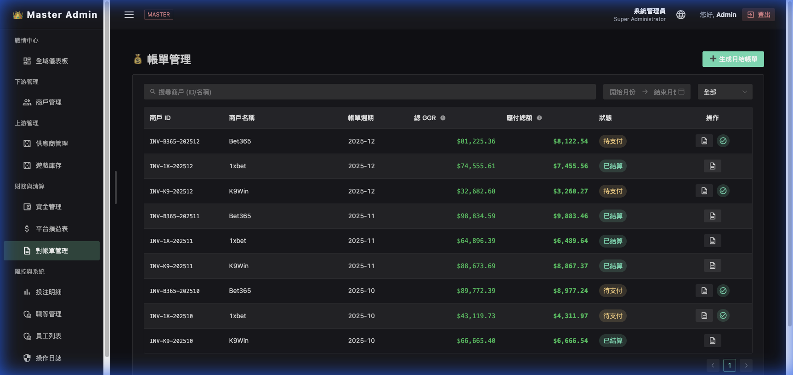
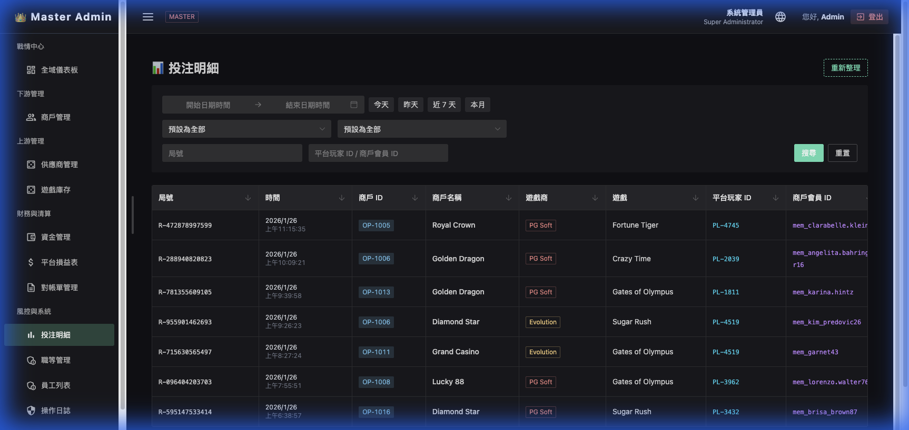
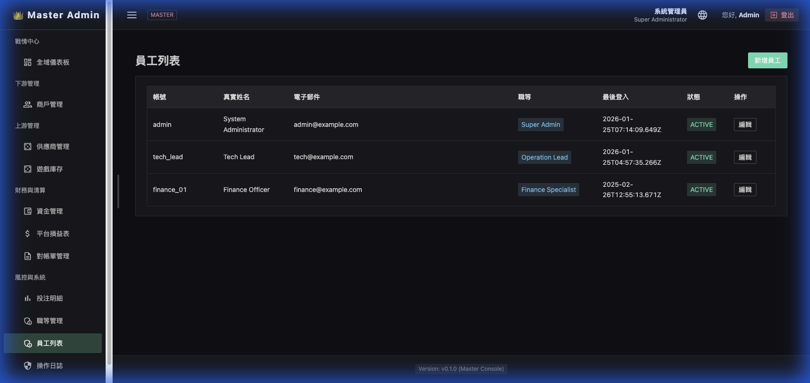
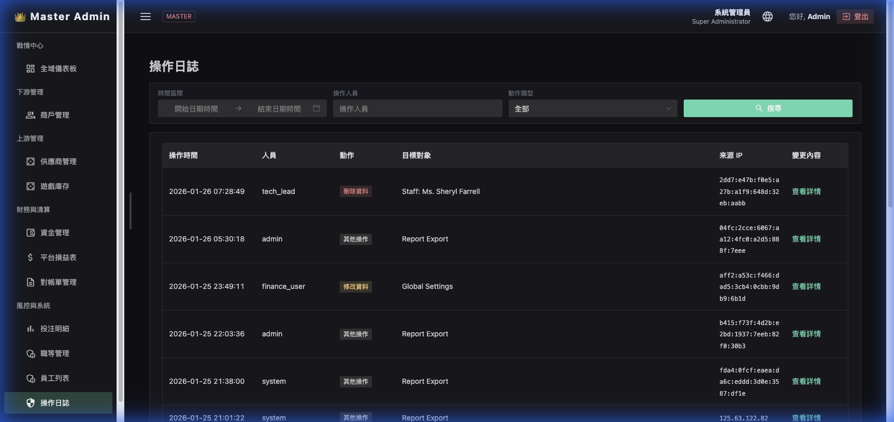
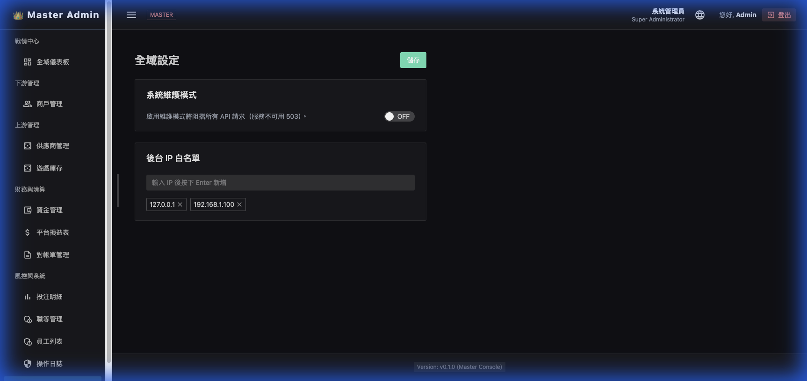

# 總控後台 (Master Admin) 操作指南

本手冊旨在引導操作人員熟悉「總控後台」各項功能，並深入說明數據邏輯、欄位定義與交互操作流程。

---

## 1. 戰情中心 (War Room)

戰情中心提供全域性的數據監控，讓管理員能即時掌握平台整體的營運狀況與系統健康度。

### 全域儀表板 (Global Dashboard)

此頁面匯總了平台最關鍵的指標與趨勢圖表。

#### A. 核心統計指標 (Summary Cards)

- **總營收 (GGR)**:
  - **定義**: 玩家總投注額 (Total Bet) 減去玩家總派彩額 (Total Win)。
  - **計算式**: `Sum(Bet Amount) - Sum(Payout Amount)`。
  - **說明**: 此數值代表平台在該時段內的總毛利。
- **活躍玩家**:
  - **定義**: 在選定時間範圍內有至少一次有效投注的唯一玩家數量。
- **API 請求總量**:
  - **定義**: 平台與供應商端及商戶端交互的總次數，用於評估系統負載。
- **平均毛利率**:
  - **計算式**: `(GGR / Total Bet) * 100%`。
  - **說明**: 代表平台每 100 元投注中能產生的收益比例。

#### B. 數據趨勢圖表

- **營收走勢 (24h)**:
  - 顯示過去 24 小時內「總營收 (GGR)」與「總投注額 (Bet)」的變化趨勢。
  - 綠線代表 GGR，藍線代表投注額。透過此圖可觀察特定時段是否出現營收異常波动。
- **供應商佔比**:
  - 圓餅圖顯示各遊戲供應商（如 PG Soft, Evolution 等）對平台總營收的貢獻比例。
  - 協助識別平台的主力內容來源。

#### C. 即時排名與健康度

- **熱門商戶 (GGR)**: 顯示產生最高營收的前五名商戶。
- **熱門遊戲 (注單量)**: 顯示目前最受玩家歡迎的前五款遊戲及其對應的總注單數。
- **系統健康度 (延遲)**: 監控與各供應商伺服器的 API 回應延遲 (Latency)。
  - **綠色 (0-200ms)**: 狀態極佳。
  - **黃色 (200-500ms)**: 輕微延遲。
  - **紅色 (>500ms)**: 系統擁塞或供應商端異常。

---

## 2. 下游管理 (Downstream)

下游管理主要用於維護商戶（運營商）的帳號、合約設定與資金餘額。

### 商戶管理 (Merchant List)

管理所有接入平台的商戶帳號。

#### A. 篩選列與操作

- **搜尋框**: 可透過「商戶 ID」或「商戶名稱」快速定位特定商戶。
- **新增商戶按鈕**: 用於建立新的商戶帳號分組。

#### B. 表格欄位說明

| 欄位名稱 | 說明 |
| :--- | :--- |
| **商戶 ID** | 系統自動生成的唯一識別碼 (例：OP-1001)。 |
| **商戶名稱** | 商戶的顯示名稱。 |
| **錢包模式** | 顯示該商戶採用的錢包類型：單一錢包 (Seamless) 或 轉帳錢包 (Transfer)。 |
| **幣別** | 該商戶結算時採用的主幣別 (如 TWD, USD, CNY)。 |
| **佔成 (%)** | 平台與該商戶約定的收益分成比例。商戶需上繳的比例越低，其留存比例越高。 |
| **餘額** | 該商戶在平台中的剩餘點數/信用額度。 |
| **狀態** | 顯示商戶帳號是否處於「啟用」或「停用」狀態。 |
| **建立時間** | 商戶帳號最初建立的日期與時間。 |

#### C. 修改與導覽

- **編輯按鈕 (齒輪圖示)**: 點擊後開啟 Modal 彈窗，可修改商戶的聯絡人資訊、分成比例、商戶金鑰 (API Key) 等敏感設定。
- **查看詳情 (小人圖示)**: 快速導覽至該商戶的子帳號列表或特定營收報表。

---

## 3. 上游管理 (Upstream)

上游管理用於維護外部遊戲供應商的同步狀態、API 連接參數以及所有遊戲產品的上下架。

### 供應商管理 (Provider List)

#### A. 功能概述

- **列表顯示**: 列出所有已對接的供應商及其當前狀態。
- **配置按鈕 (齒輪)**: 設定供應商的 API Endpoint、Merchant ID 及安全性祕鑰。

#### B. 欄位定義

- **供應商 ID**: 內部系統識別碼。
- **供應商名稱**: 品牌顯示名稱（如 Pragmatic Play）。
- **同步狀態**:
  - **同步中**: 正在抓取最新的遊戲列表。
  - **已同步**: 數據與供應商端同步。
- **狀態**: 可手動關閉特定供應商的所有遊戲維護頁面。

### 遊戲庫存 (Game Inventory)

集中管理全平台數千款遊戲的顯示、分類與開關。

#### A. 多維篩選

- **供應商下拉選單**: 快速過濾特定品牌的遊戲。
- **遊戲類型**: 篩選老虎機、真人視訊、體育博彩等。
- **狀態篩選**: 僅查看「已下架」或「維護中」的項目。

#### B. 重要欄位說明

- **RTP (1h)**: 該遊戲過去 1 小時內的即時返獎率。用於監控遊戲是否偏離理論數值。
- **平台狀態**: 總控端對該遊戲的權限控管。若總控關閉，下游所有商戶皆無法啟動該遊戲。

---

## 4. 財務與清算 (Finance & Settlement)

財務模組是平台運行的核心，負責管理商戶額度、處理結算單據以及分析整體獲利情。

### 資金管理 (Fund Management)

處理商戶的充值、扣款與額度調整。

#### A. 資金調整流程

1. 點擊商戶行末尾的「調整」按鈕。
2. 在彈窗中選擇「充值」或「扣款」。
3. 輸入金額與**備註**（必填，用於日後審計）。
4. 點擊確認，系統將即時更新商戶餘額並生成審計日誌。

### 平台損益表 (Platform P&L)

提供高密度的財務數據分析，支援從不同維度檢視營收。

#### A. 數據維度與篩選

- **維度切換**: 支援以「日期」或「商戶」作為主要分組依據。
- **日期範圍**: 選取特定區間進行數據回溯。

#### B. 表格核心數值邏輯

- **總投注 (Total Bet)**: 該時段內所有玩家下注的金額總和。
- **總派彩 (Total Win)**: 該時段內玩家贏得並返還至錢包的金額總和。
- **總營收 (GGR)**: `總投注 - 總派彩`。代表遊戲流水產生的盈餘。
- **返獎率 (RTP%)**: `(總派彩 / 總投注) * 100%`。
  - **警示機制**: 若單日 RTP% 超過 100%，代表玩家赢錢多於投注（爆分），欄位將標示為**紅色**提示注意。
- **局數 (Count)**: 該時段內的總注單數量。

### 到帳單管理 (Invoice Management)

管理每個月度或週期的結算單據，追蹤商戶的繳費進度。

#### A. 狀態定義

- **草稿**: 結算日生成的初始帳單，可手動調整。
- **未支付**: 已派發給商戶，等待入帳。
- **已結清**: 資金已到帳，該週期結清。
- **已過期**: 超過約定繳款期限。

---

## 5. 風控與系統 (Risk & System)

維護系統安全性與運行規則，並提供底層的數據查詢與審計功能。

### 投注明細 (Bet Query)

全平台最細顆粒度的注單查詢工具，用於處理玩家糾紛或風控調查。

#### A. 查詢維度

- **局號 (Transaction ID)**: 最精確的單一注單索引。
- **平台玩家 ID / 商戶會員 ID**: 追蹤特定玩家的投注行為。
- **時間維度**: 支援跨度查詢，定位特定爭議時段。

#### B. 交互功能

- **重新整理按鈕**: 獲取最新入庫的注單。
- **供應商 ID 標籤**: 點擊可查看該筆注單在供應商端的原始回應 XML/JSON。

### 職等管理 (Job Levels)

基於角色存取控制 (RBAC) 的權限管理系統。

#### A. 權限樹操作

- **樹狀結構**: 點擊節點前的箭頭可展開子選單權限。
- **勾選邏輯**:
  - 勾選父節點會自動選中所有子節點。
  - 支援細部按鈕級（如「匯出」、「刪除」）的權限控管。

### 員工列表 (Staff List)

管理後台登錄帳號的安全性與角色掛載。

#### A. 資安管理

- **綁定 IP**: 可限制特定員工僅能從授權的辦公室 IP 登錄。
- **狀態切換**: 可即時封禁離職員工帳號。

### 操作日誌 (Audit Log)

完整記錄管理員在後台的所有操作，確保「凡走過必留下痕跡」。

- **核心內容**: 包含「操作人」、「操作類型（如：修改分成比例）」、「舊值」、「新值」及「操作時間」。

### 系統設定 (System Settings)

定義平台的全局維護開關與安全性原則。

- **全平台維護**: 一鍵切換平台進入維護模式。
- **API 通訊密鑰**: 生成與更新與商戶通訊時使用的加密因子。
