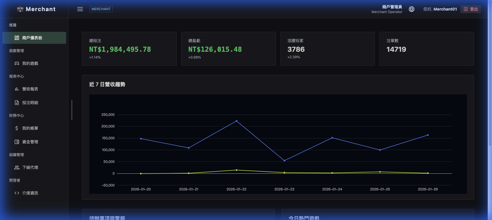
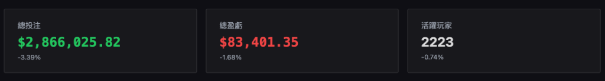
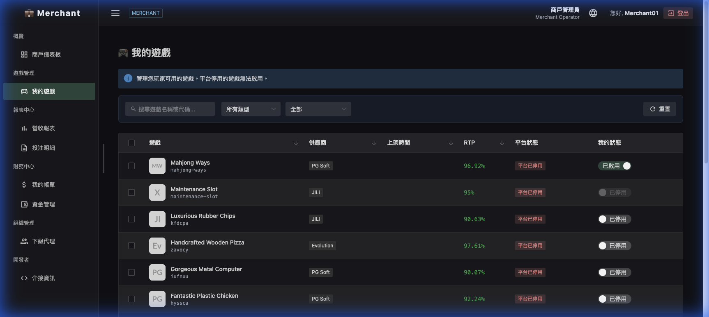
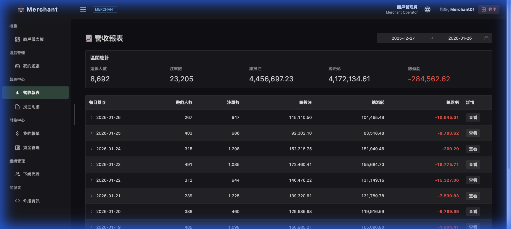
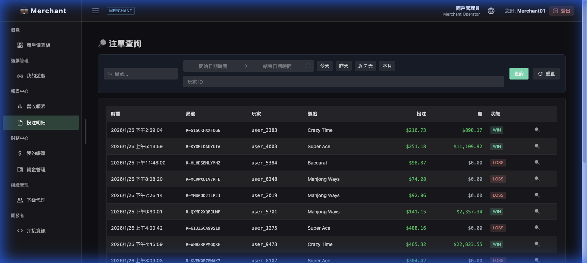
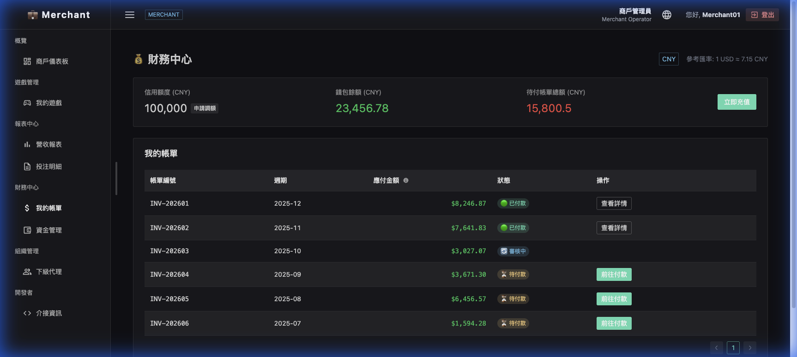
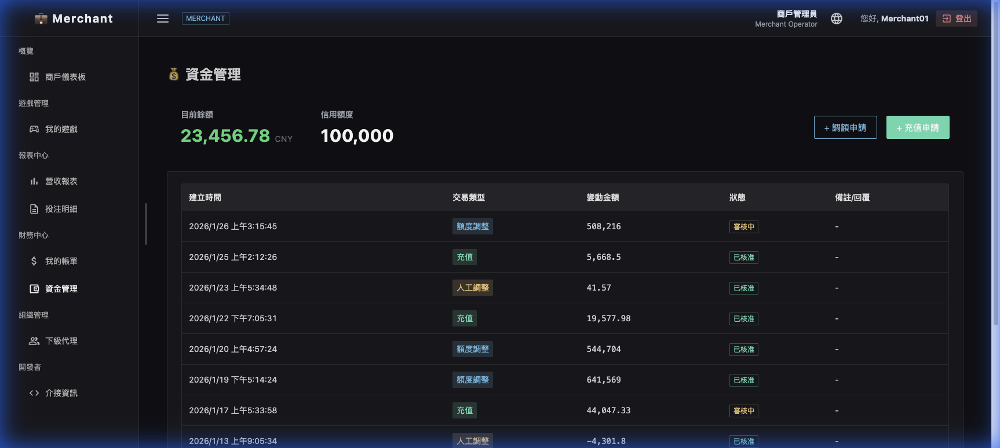
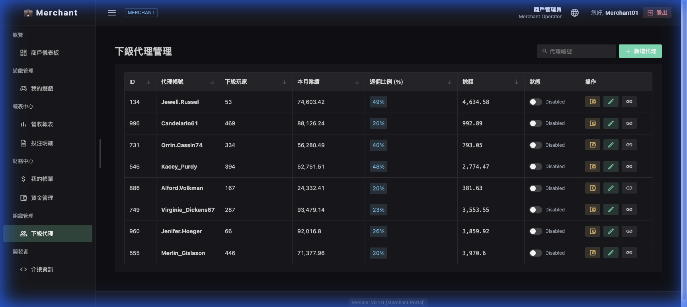
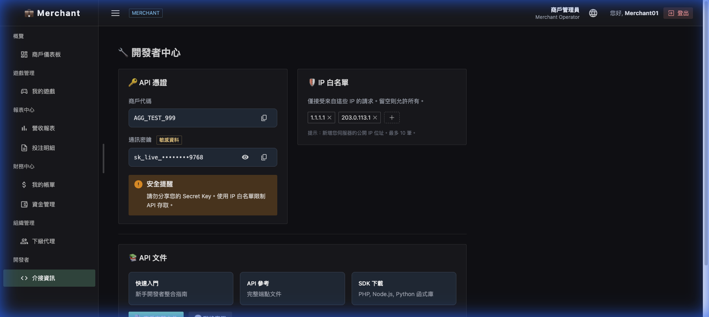

# 商戶後台 (Merchant Admin) 操作指南

本手冊旨在引導商戶管理員熟悉「商戶後台」各項功能，並深入說明數據邏輯、欄位定義與交互操作流程。

---

## 1. 概覽 (Overview)

### 商戶儀表板 (Merchant Dashboard)

商戶管理員每日登入後的第一站，用於即時監控營運關鍵指標 (KPI)。

#### A. 數據中心 (KPI 卡片)

- **總投注 (Total Bet)**:
  - **定義**: 當日所有玩家在遊戲中投入的原始投注金額總計。
- **總盈虧 (GGR)**:
  - **定義**: 商戶當日的獲利收益。
  - **計算式**: `Sum(總投注) - Sum(總派彩)`。
  - **顯示**: 綠色代表獲利 (正值)，紅色代表虧損 (負值)。
- **活躍玩家**:
  - **定義**: 當日進行過至少一次有效投注的不重複玩家數量。
- **較昨日同期**:
  - **計算式**: `(今日當前值 - 昨日同期值) / 昨日同期值 * 100%`。
  - **說明**: 提供即時的日環比趨勢參考，協助管理員判斷當前時段的增長情況。

#### B. 營運趨勢與警報

- **7日營收趨勢**: 顯示過去一週總投注與總盈虧的變動曲線。
- **待處理警報**: 包含欠費清單通知或信用額度預警，點擊可快速跳轉處理。

---

## 2. 遊戲管理 (Game Management)

### 我的遊戲 (My Games)

管理員在此決定站點要對玩家開放的遊戲清單。

#### A. 篩選與搜尋

- **搜尋框**: 支援透過「遊戲名稱」或「Game ID」查詢。
- **類型/狀態**: 可依據遊戲類別或上架狀態進行過濾。

#### B. 欄位定義

- **RTP (即時回報率)**:
  - **定義**: 該遊戲過去 1 小時內的實際返獎比例。
  - **計算式**: `(1h 總派彩 / 1h 總投注) * 100%`。
- **平台狀態**: 總控端設定的權限，若為「平台已停用」則商戶無法開啟。
- **我的狀態**: 商戶自主開關。
  - **已啟用**: 前端站點同步顯示。
  - **已停用**: 前端站點即時隱藏。

---

## 3. 報表中心 (Report Center)

### 營收報表 (Revenue Report)

用於核對每日經營數據，支援多層級展開分析。

#### A. 核心數據邏輯

- **層級結構**: 點擊日期可展開查看各「遊戲類別」細分出的數據。
- **總盈虧 (GGR)**: `總投注 - 總派彩`。
- **詳情抽屜**: 點擊查看可開啟抽屜式面板，顯示該區間內的所有玩家交易流水。

### 投注明細 (Bet Query)

最細顆粒度的注單查詢工具，用於處理爭議或風控查詢。

- **狀態標籤**: WIN (贏)、LOSS (輸)、REFUND (退款)。
- **JSON 檢視器**: 點擊放大鏡可查閱該筆注單在 API 端回傳的技術原始參數。

---

## 4. 財務中心 (Finance Center)

### 我的帳單 (My Invoices)

商戶與平台進行週次或月次對帳結算的頁面。

- **信用額度**: 平台核發給商戶的營運透支額度。
- **應付金額**: `區間總營收 * 約定佔成比例`。
- **支付彈窗**: 需在此提交支付具結，包括輸入交易 HASH (TXID) 並上傳憑證。

### 資金管理 (Fund Management)

用於查看錢包餘額詳情與提交額度變更申請。

- **當前餘額 (Current Balance)**: 商戶目前可用的實時現金餘額。
- **信用額度 (Credit Limit)**: 平台授權的可透支上限，用於維持高峰期營運。
- **申請紀錄**:
  - **申請充值**: 記錄商戶向平台提交的加款需求，待平台核准後入帳。
  - **申請額度**: 當信用額度不足時，可在此提交調額申請並註明原因。

---

## 5. 組織管理 (Organization)

### 下級代理 (Sub-Agent List)

用於發展二級代理商，管理員可以在此配置各代理的分潤比例。

- **返佣比例 (Slider)**: 設定代理商的收益比例，不可超過主商戶自身佔成。
- **狀態管理**: 支援快速切換代理商帳號的啟用/禁用狀態。
- **新增代理**: 可直接建立下級帳號並設定初始權限與分潤比例。

---

## 6. 技術對接 (Developer)

### 介接資訊 (Integration Info)

技術團隊整合 API 的核心入口。

- **通訊密鑰 (Secret Key)**: 用於 API 請求簽名校驗。
- **IP 白名單 (Tags)**: 僅限清單內的 IP 可發起 API 呼叫，確保介接安全。
